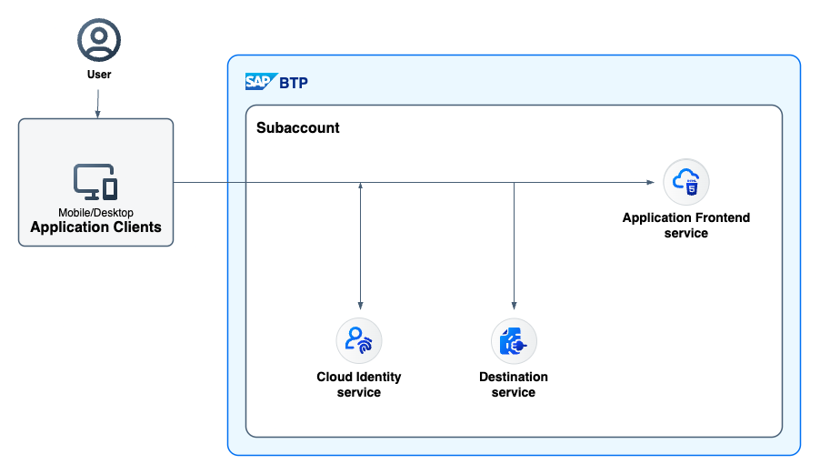

# SAP Fiori Application using the Application Frontend Service CLI (afctl)

## Diagram



## Description

This an example of an SAP Fiori application that is deployed to the [Application Frontend service](https://help.sap.com/docs/application-frontend-service/application-frontend-service/what-is-application-frontend-service) via its CLI ([afctl](https://www.npmjs.com/package/@sap/appfront-cli)). The Application Frontend service comes with the capabilities of the [application router](https://www.npmjs.com/package/@sap/approuter), so applications must include an [xs-app.json](./webapp/xs-app.json) file (also see [minimal requirements](https://help.sap.com/docs/application-frontend-service/application-frontend-service/preparing-applications-for-application-frontend-service)). Additional configuration such as destinations (via environment variables) are provided during deployment via the [conf.json](./conf.json) file.

## Download and Deployment

1. Follow the [initial setup guide](https://help.sap.com/docs/application-frontend-service/application-frontend-service/initial-setup) for the Application Frontend service.
1. Install the Application Frontend service CLI (afctl) and login according to its [documentation](https://www.npmjs.com/package/@sap/appfront-cli).
1. Download the source code:
    ```
    git clone https://github.com/SAP-samples/multi-cloud-html5-apps-samples
    cd multi-cloud-html5-apps-samples/application-frontend-afctl
    ```
1. Build the project:
    ```
    npm install
    npm run build
    ```
1. Deploy the project:
    ```
    afctl push dist -c conf.json -l
    ```
1. List the deployed HTML5 apps:
    ```
    afctl list
    ```

## Check the Result

### List the Deployed HTML5 Apps
```
$ afctl list
OK

Applications

Name                                    Version  URL                                                                    
sample.manage.products.app.front.afctl  0.0.1    https://samplemanageproductsappfrontafctl-ge8od.eu12.appfront.cloud.sap
```

### Check the SAP Fiori Application

Access one of the URLs described in the [Download and Deployment](#download-and-deployment) section. You are redirected to a sign-on page before you can see the app.


