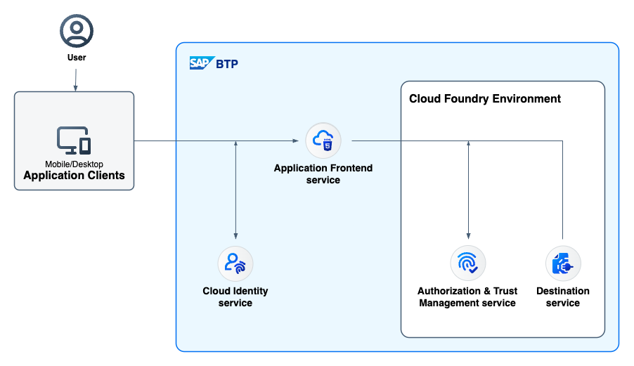
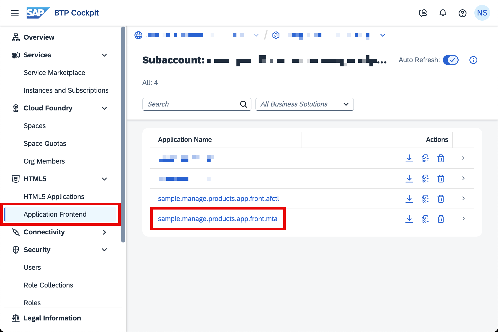
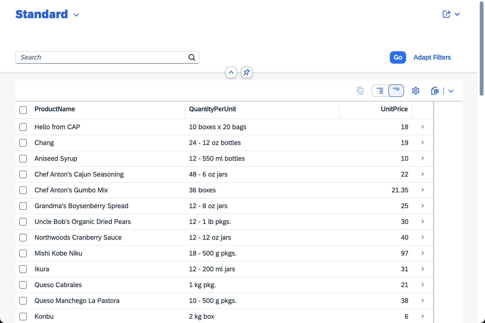

# Multi-Target Application (MTA): SAP Fiori Application using the Application Frontend Service

## Diagram



## Description

This an example of a multi-target application (MTA) including a SAP Fiori application that is deployed to the [Application Frontend service](https://help.sap.com/docs/application-frontend-service/application-frontend-service/what-is-application-frontend-service) via the Generic Application Content Deployer. The Application Frontend service comes with the capabilities of the [application router](https://www.npmjs.com/package/@sap/approuter), so applications must include an [xs-app.json](./webapp/xs-app.json) file (also see [minimal requirements](https://help.sap.com/docs/application-frontend-service/application-frontend-service/preparing-applications-for-application-frontend-service)).

> This sample comes with the option of using either the [Northwind OData service](https://services.odata.org/v4/Northwind/Northwind.svc) or a [self-hosted backend service](/optional-self-hosted-backend/README.md). By default, the Northwind OData service is used. If you want to use the self-hosted backend instead, go into the [ui5.yaml](uimodule/ui5.yaml) file and use the `ui5-middleware-cap` (currently commented out) instead of the `fiori-tools-proxy`. Also make sure to change the destination url in the [mta.yaml](mta.yaml) file to point to your (deployed) self-hosted backend service.

## Download and Deployment

1. Follow the [initial setup guide](https://help.sap.com/docs/application-frontend-service/application-frontend-service/initial-setup) for the Application Frontend service.
1. Download the source code:
    ```
    git clone https://github.com/SAP-samples/multi-cloud-html5-apps-samples
    cd multi-cloud-html5-apps-samples/application-frontend-mta
    ```
1. Build the project:
    ```
    npm install
    npm run build
    ```
1. Login to Cloud Foundry using the Cloud Foundry CLI (see [tutorial](https://developers.sap.com/tutorials/cp-cf-download-cli.html)):
    ```
    cf login -a <API Endpoint>
    ```
1. Deploy the project:
    ```
    npm run deploy
    ```

## Check the Result

### List the Deployed HTML5 Apps

You can find a list of all deployed HTML5 applications for the Application Frontend service in the SAP BTP Cockpit:



### Check the SAP Fiori Application

Click on the link of the deployed HTLM5 application in the SAP BTP Cockpit to open it. You are redirected to a sign-on page before you can see the app.


