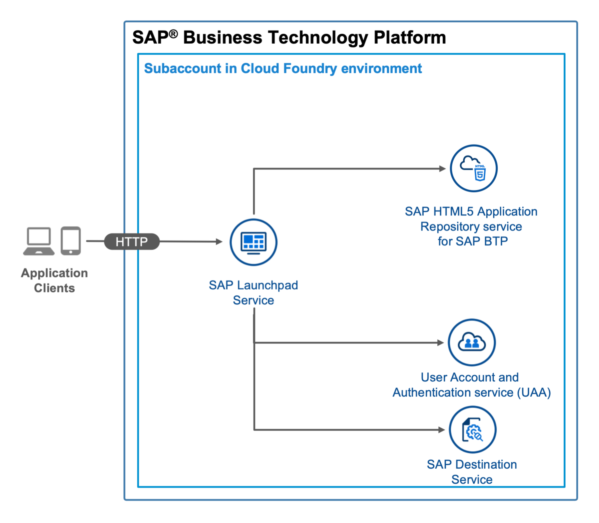

# Basic HTML5 App on HTML5 Application Runtime managed by SAP Cloud Platform

## Diagram




## Description

This is an example of an HTML5 app that is managed by SAP Cloud Platform and is integrated into a SAP Cloud Launchpad. During the build process (`mbt build`), the  app is compressed into a zip file. During the deployment (`cf deploy`), the HTML5 app is pushed to the HTML5 Application Repository and uses the Authentication & Authorization service (XSUAA service) and the destination service.

## Download and Deployment
1. Subscribe to the [launchpad service](https://developers.sap.com/tutorials/cp-portal-cloud-foundry-getting-started.html) if you haven't done so before.
1. Download the source code:
    ```
    git clone https://github.com/SAP-samples/multi-cloud-html5-apps-samples
    cd multi-cloud-html5-apps-samples/managed-html5-runtime-basic-mta
    ```
2. Build the project:
    ```
    npm install
    npm run build
    ```
3. Deploy the project:
    ```
    cf deploy mta_archives/hello-world_1.0.0.mtar
    ```

If the deployment has been successful, you will be able to form the URL of the app based on the URL of launchpad. It will have the following structure: <https://[globalaccount-id].launchpad.cfapps.[region].hana.ondemand.com/basicservice.helloworld/index.html>

## Check the Result

### List the Deployed HTML5 Apps
```
$ cf html5-list                                     
Getting list of HTML5 applications in org 9f10ed8atrial / space dev as firstname.lastname@domain.com...
OK

name                   version   app-host-id                            service instance                     visibility   last changed   
helloworld             1.0.0     35e11503-bcc8-4d1e-95e2-2a196cd5ebb9   hello-world-html5-app-host-service   public       Mon, 10 Aug 2020 15:35:38 GMT 
```

### List the Deployed MTA

```
$ cf mta hello-world
Showing health and status for multi-target app hello-world in org 9f10ed8atrial / space dev as firstname.lastname@domain.com...
OK
Version: 1.0.0

Apps:
name   requested state   instances   memory   disk   urls   

Services:
name                                 service           plan          bound apps   last operation   
hello-world-destination-service      destination       lite                       create succeeded   
hello-world-html5-app-host-service   html5-apps-repo   app-host                   create succeeded   
hello-world-xsuaa-service            xsuaa             application                create succeeded  

```

### Check the HTML5 App

Access the URL described in [Download and Deployment](#download-and-deployment) to view the web app. You are redirected to a sign-on page before you can see the web app.


