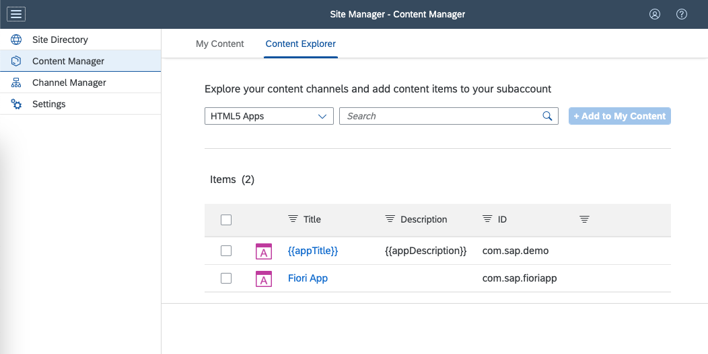
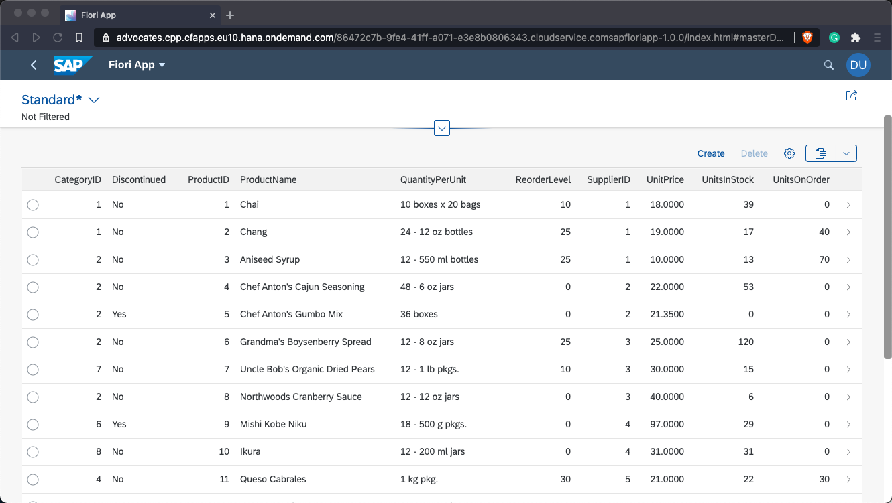

# SAP Fiori App with a Managed Application Router Exposed to SAP Launchpad Service

## Diagram


## Description

This is an example of an SAP Fiori app ([HTML5Module](./HTML5Module/) that is configured to run with the managed application router. The app is exposed to SAP Build Work Zone, standard edition and is visible in the content manager of the launchpad. The app is deployed to the HTML5 Application Repository via the Cloud Foundry environment and uses the Authentication & Authorization (XSUAA) and the destination service. It consumes the public [Northwind OData service](https://services.odata.org/v2/Northwind/Northwind.svc) - to use instead a CAP service with required authentication have look at [optional-self-hosted-backend](../optional-self-hosted-backend/).

## Download and Deployment
1. Subscribe to the [SAP Build Work Zone, standard edition](https://developers.sap.com/tutorials/cp-portal-cloud-foundry-getting-started.html) if you haven't done so before.
2. Download the source code:
    ```
    git clone https://github.com/SAP-samples/multi-cloud-html5-apps-samples
    cd multi-cloud-html5-apps-samples/managed-html5-runtime-fiori-launchpad-mta
    ```
3. Build the project:
    ```
    npm install
    npm run build
    ```
4. Deploy the project:
    ```
    npm run deploy
    ```
    or
    ```
    cf deploy mta_archives/managed-html5-runtime-fiori-launchpad-mta.mtar
    ```
5. List the deployed HTML5 apps:
    ```
    cf html5-list -di sample-manage-products-destination -u --runtime launchpad
    ```

> Use the following command in case you use the Portal service
>
>  `cf html5-list -di sample-manage-products-destination -u --runtime cpp`


## Check the Result

### List the Deployed HTML5 Apps
```
$ cf html5-list -di sample-manage-products-destination -u --runtime launchpad
Getting list of HTML5 applications available via destinations in org e983544etrial / space dev as nicolai.schoenteich@sap.com...
OK

name                                    version   app-host-id                            service name                     destination name                           destination service name             last changed                    url   
samplemanageproductsfiorilaunchpadmta   0.0.1     e436f722-995c-4e5e-86ce-fab1b1138738   multi-cloud-html5-apps-samples   sample-manage-products-destination-html5   sample-manage-products-destination   Wed, 30 Apr 2025 12:57:18 GMT   https://e983544etrial.launchpad.cfapps.us10.hana.ondemand.com/41648f37-046e-40cb-9537-88d604988f21.multi-cloud-html5-apps-samples.samplemanageproductsfiorilaunchpadmta-0.0.1/ 
```

### List the Deployed MTA

```
$ cf mta sample-manage-products-fiori-launchpad-mta
Showing health and status for multi-target app sample-manage-products-fiori-launchpad-mta in org e983544etrial / space dev as nicolai.schoenteich@sap.com...
OK
Version: 1.0.0
Namespace: 

Apps:
name   requested state   instances   memory   disk   urls

Services:
name                                     service           plan          bound apps   last operation
sample-manage-products-html5-repo-host   html5-apps-repo   app-host                   create succeeded
sample-manage-products-destination       destination       lite                       create succeeded
sample-manage-products-auth              xsuaa             application                create succeeded
```


### List the Deployed Content with the Content Explorer




### Check the HTML5 Apps

Access one of the URLs described in the [Download and Deployment](#download-and-deployment) section. You are redirected to a sign-on page before you can see the app.


