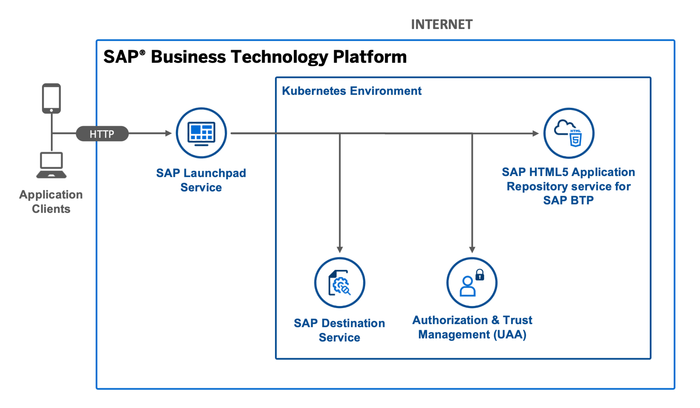
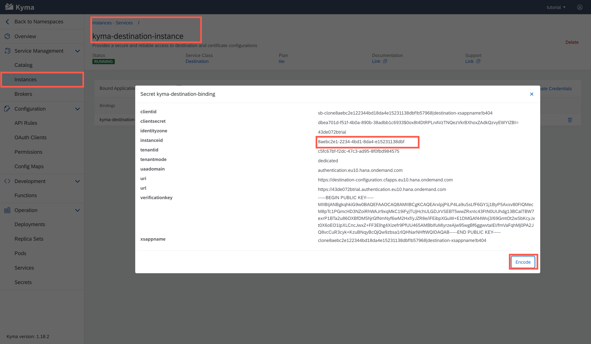
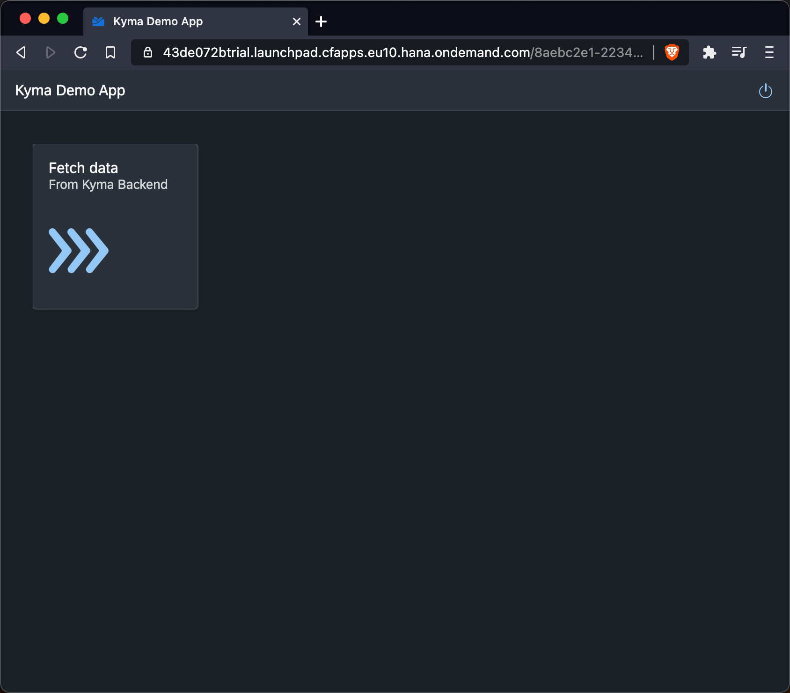

# Basic SAPUI5 App with a Managed Application Router and a Backend Component in the Kyme Runtime


## Diagram




## Description

This is an example of an SAPUI5 app that is managed by SAP Cloud Platform and a backend component that runs in the Kyma runtime. The SAPUI5 app is exposed to an SAP Cloud Platform Launchpad and is visible in the content manager of the launchpad. The app is deployed to the HTML5 Application Repository via the Cloud Foundry environment and uses the Authentication & Authorization service (XSUAA service) and the destination service. 
The backend component accepts incoming requests and returns the payload of the decoded JWT token (if available) at `/be`.


As a result of deploying this `/deployment.yaml` you will get 2 pods:

1. `html5appdeployer` - an html5-app-deployer library based application that uploads favorites html5 application to HTML5 Application Repository and generates the required destinations.
2. `backend` - a simple nodejs server that returns the JWT forwarded by the central approuter

In addition the following service instances are created:
- xsuaa/application service instance bound to backend container
- html5-apps-repo/app-host service instance bound to html5appdeployer container (used to upload content to html5 repo)
- destination/lite instance - this is for future use - (automatically generate destination configurations on instance level)

## Download and Deployment
1. Have an account for a Docker registry and log in the the docker CLI (e.g. [DockerHub](https://docs.docker.com/docker-hub/))
1. [Install the Kubernetes Command Line Tool](https://developers.sap.com/tutorials/cp-kyma-download-cli.html)
1. Subscribe to the [launchpad service](https://developers.sap.com/tutorials/cp-portal-cloud-foundry-getting-started.html) if you haven't done so before.
2. Build and upload the docker image of the backend component
   ```
    cd kyma-html5-repo-example/backend
    docker build -t iobert/kyma-simple-backend .
    docker push iobert/kyma-simple-backend
    ```
2. Build and upload the docker image of the html5 app deployer 
   ```
    cd ../html5-app-deployer
    docker build -t iobert/kyma-html5-app-deployer 
    docker push iobert/kyma-html5-app-deployer
    ```
4. Add your account id (e.g. "43de072btrial") to the destination which is defined in line 114 of the [deployment descriptor](html5-app-deployer/deployment.yaml).
2. Deploy the project
   ```
   kubectl apply -f deployment.yaml
   ```
       
2. Access the web app via the SAP BTP cockpit or assemble the URL according to the following pattern:
   ```
   https://<account id>.launchpad.cfapps.eu10.hana.ondemand.com/<destination service instance ID>.businessservice.tokendisplay/index.html    ->
   https://43de072btrial.launchpad.cfapps.eu10.hana.ondemand.com/8aebc2e1-2234-4bd1-8da4-e15231138dbf.businessservice.tokendisplay/index.html
   ```

   > You can find the destination service instance ID in the Kyma console
   


## Check the Result

### Check the HTML5 App

Access the URL described in [Download and Deployment](#download-and-deployment) to view the web app. You are redirected to a sign-on page before you can see the web app.


