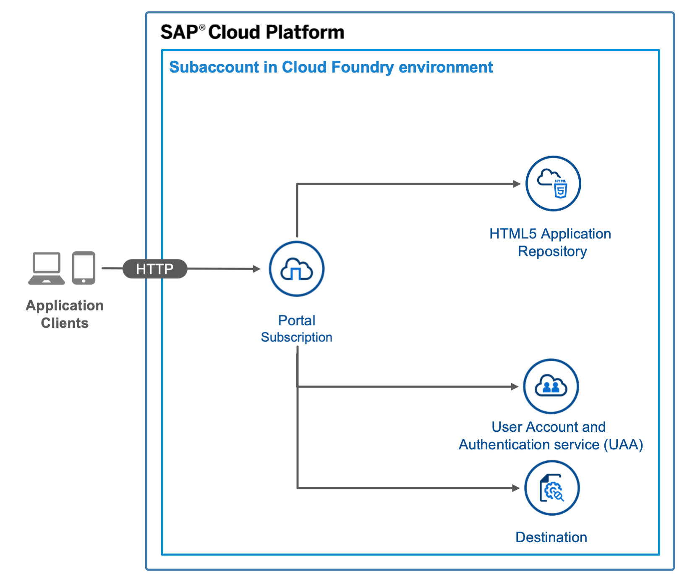

# App on HTML5 Application Runtime managed by SAP Cloud Platform with XSUAA- and Destination Service

## Diagram




## Description

This is an example of an HTML5 app that is managed by SAP Cloud Platform. The app is deployed to the HTML5 Application Repository and uses the Authentication & Authorization service (XSUAA service) and the destination service.

## Download and Deployment
1. Download the source code:
    ```
    git clone https://github.com/SAP-samples/cloud-cap-nodejs-codejam/multi-cloud-html5-apps-samples
    cd multi-cloud-html5-apps-samples/managed-html5-runtime-mta-hello-world
    ```
2. Build the project:
    ```
    npm install
    npm run build
    ```
3. Deploy the project:
    ```
    cf deploy mta_archives/hello-world_1.0.0.mtar
    ```

If the deployment has been successful, you find the URL of the application router in the console output. It will have the following structure: <https://[globalaccount-id]-[subaccount-id]-dev-multi-cloud-html5-apps-samples.cfapps.eu10.hana.ondemand.com>.

## Configuration
To change the path to the default application, edit the `welcomeFile` property in the [`xs-app.json`](router/xs-app.json) configuration file of the application router.

You receive a `503 Service Temporarily Unavailable` error if there is no application with the defined name in the HTML5 Application Repository.

## Check the Result

### List the Deployed HTML5 Apps
```
$ cf html5-list                                     
Getting list of HTML5 applications in org 9f10ed8atrial / space dev as firstname.lastname@domain.com...
OK

name                   version   app-host-id                            service instance                     visibility   last changed   
helloworld             1.0.0     35e11503-bcc8-4d1e-95e2-2a196cd5ebb9   hello-world-html5-app-host-service   public       Mon, 10 Aug 2020 15:35:38 GMT 
```

### List the Deployed MTA

```
$ cf mta hello-world
Showing health and status for multi-target app hello-world in org 9f10ed8atrial / space dev as firstname.lastname@domain.com...
OK
Version: 1.0.0

Apps:
name   requested state   instances   memory   disk   urls   

Services:
name                                 service           plan          bound apps   last operation   
hello-world-destination-service      destination       lite                       create succeeded   
hello-world-html5-app-host-service   html5-apps-repo   app-host                   create succeeded   
hello-world-xsuaa-service            xsuaa             application                create succeeded  

```

### Check the HTML5 App

Access the URL to view the web app. You are redirected to a sign-on page before you can see the web app.

