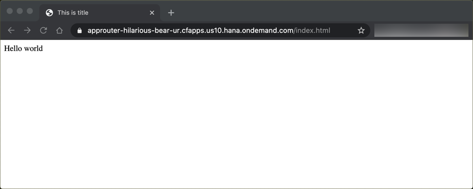

# On Standalone Application Router

## Diagram


## Description

This is an example of an HTML5 app that you maintain on a standalone application router in your own space. The app is directly embedded into your subaccount on the Cloud Foundry environment. That means the static content of the is **not** stored and managed in the HTML5 Application Repository of SAP BTP.


## Download and Installation
1. Download the source code:
    ```
    git clone https://github.com/SAP-samples/multi-cloud-html5-apps-samples
    cd multi-cloud-html5-apps-samples/standalone-approuter-html5-local-dir
    ```
3. Deploy the application router:
    ```
    cf push approuter --random-route
    ```

If the deployment has been successful, you find the URL of the application router in the console output. or you can print it on Unix-based systems with `cf app approuter | awk '/^routes/ { print "https://"$2"/" }'`. It has the following structure: 

<https://approuter-[random-path].cfapps.[region].hana.ondemand.com>.


## Configuration
To change path to the default app, edit the `welcomeFile` property in the [`xs-app.json`](router/xs-app.json) configuration file of the app router. You can replace the content of `webapp` to embed another web app in the application router. 


## Check the Result

### List the Deployed Applications

```
$ cf apps
Getting apps in org 9f10ed8atrial / space dev as firstname.lastname@domain.com...
OK

name        requested state   instances   memory   disk   urls
approuter   started           1/1         1G       1G    approuter-hilarious-bear-ur.cfapps.us10.hana.ondemand.com
```

### Check the HTML5 App

Access the URL to check the web app.
