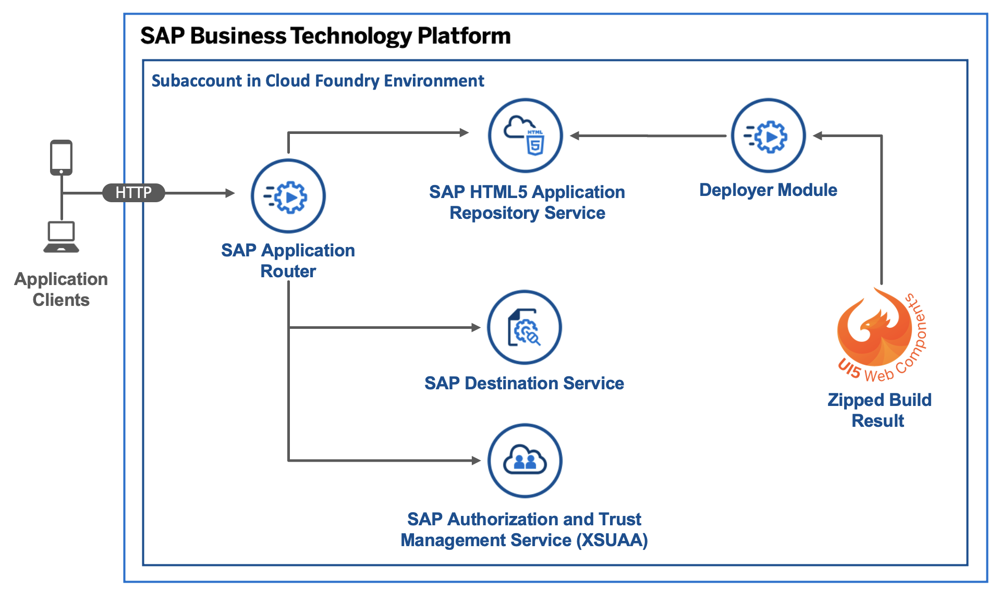

# On Standalone Application Router, Using HTML5 Application Repository with UI5 Webcomponents, XSUAA Service, and Destination Service 

## Diagram



## Description
This is an example of an HTML5 app built with UI5 Webcomponents that you maintain on a standalone application router in your own space in the Cloud Foundry environment. The app is deployed to the HTML5 Application Repository and uses the Authentication & Authorization service (XSUAA service), the destination service, and the User API service.


## Download and Installation
1. Download the source code:
    ```
    git clone https://github.com/SAP-samples/multi-cloud-html5-apps-samples
    cd multi-cloud-html5-apps-samples/standalone-approuter-html5-mta-ui5webcomponents
    ```
2. Build the project:
    ```
    npm install
    npm run build
    ```
3. Deploy the project:
    ```
    cf deploy mta_archives/standalone-approuter-ui5webcomponents_1.0.0.mtar
    ```

If the deployment has been successful, you find the URL of the application router in the console output or you can print it on Unix-based systems with `cf app approuter | awk '/^routes/ { print "https://"$2"/" }'`. It probably has the following structure: <https://[cf-org-name]-dev-approuter.cfapps.eu10.hana.ondemand.com>.


## Configuration

You can replace the content of the `ui5webcomponents` folder with your own HTML5 app. Please note that the `html5deployer` expects a zipped version of your build result (in our case the build result is our `dist` folder). Check the build script at [`package.json`](ui5webcomponents/package.json) to see an example of that. Keep in mind that your app id in the `manifest.json` has to match the target for path `^(.*)` (all incoming requests) in the [`xs-app.json`](approuter/xs-app.json).

## Check the Result

### List the Deployed HTML5 App

```
$ cf html5-list                                     
Getting list of HTML5 applications in org [cf-org-name] / space dev as firstname.lastname@domain.com...
OK

name               version   app-host-id                            service instance   visibility   last changed   
ui5webcomponents   1.0.0     1db2ae23-90e9-4055-a22c-6865ca7ad73e   html5_repo_host    public       Mon, 10 Aug 2020 13:26:03 GMT   
```

### List the Deployed MTA

```
$ cf mta standalone-approuter-ui5webcomponents_1.0.0.mtar
Showing health and status for multi-target app standalone-approuter-ui5webcomponents_1.0.0.mtar in org [cf-org-name] / space dev as firstname.lastname@domain.com...
OK
Version: 1.0.0

Apps:
name               requested state   instances   memory   disk   urls   
approuter   started           1/1         256M     256M   [cf-org-name]-dev-approuter.cfapps.eu10.hana.ondemand.com

Services:
name                 service           plan          bound apps         last operation   
html5_destination    destination       lite          approuter          create succeeded   
html5_repo_host      html5-apps-repo   app-host                         create succeeded   
html5_repo_runtime   html5-apps-repo   app-runtime   approuter          create succeeded   
html5_uaa            xsuaa             application   approuter          create succeeded   
```

### Check the Web App

Access the URL to view the web app. You are directed to a sign-on page before you can see the web app that display your name.


