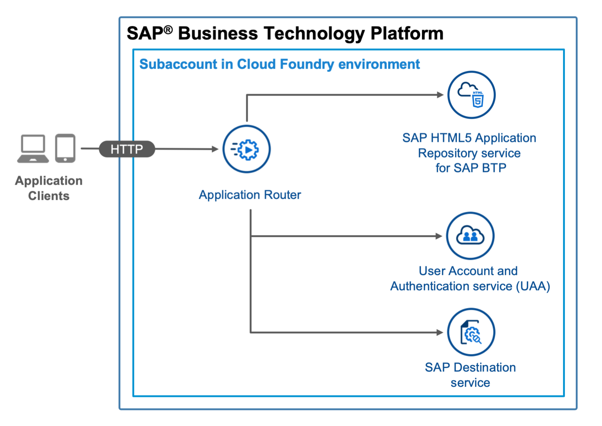
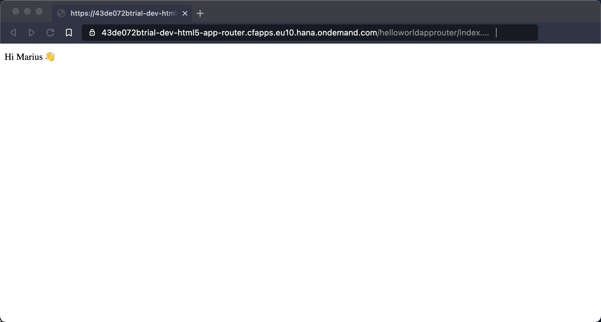

# On Standalone Application Router, Using HTML5 Application Repository, XSUAA Service, and Destination Service 

## Diagram



## Description
This is an example of an HTML5 app that you maintain on a standalone application router in your own space in the Cloud Foundry environment. The app is deployed to the HTML Application Repository and uses the Authentication & Authorization service (XSUAA service) and the destination service.


## Download and Installation
1. Download the source code:
    ```
    git clone https://github.com/SAP-samples/multi-cloud-html5-apps-samples
    cd multi-cloud-html5-apps-samples/standalone-approuter-html5-mta-hello-world
    ```
2. Build the project:
    ```
    npm install
    npm run build
    ```
3. Deploy the project:
    ```
    cf deploy mta_archives/standalone-hello-world_1.0.0.mtar
    ```

If the deployment has been successful, you find the URL of the application router in the console output or you can print it on Unix-based systems with `cf app html5_app_router | awk '/^routes/ { print "https://"$2"/" }'`. It probably has the following structure: <https://[globalaccount-id]-dev-multi-cloud-html5-apps-samples.cfapps.eu10.hana.ondemand.com>.


## Configuration

You can replace the content of the `HTML5Module` folder with your own HTML5 app. Keep in mind that you also need to change the path to the default app if your web app has a different ID.

To change the path to the default app, edit the `welcomeFile` property in the [`xs-app.json`](router/xs-app.json) configuration file of the application router.

## Check the Result

### List the Deployed HTML5 App

```
$ cf html5-list                                     
Getting list of HTML5 applications in org 9f10ed8atrial / space dev as firstname.lastname@domain.com...
OK

name         version   app-host-id                            service instance   visibility   last changed   
helloworld   1.0.0     1db2ae23-90e9-4055-a22c-6865ca7ad73e   html5_repo_host    public       Mon, 10 Aug 2020 13:26:03 GMT   
```

### List the Deployed MTA

```
$ cf mta standalone-hello-world
Showing health and status for multi-target app standalone-hello-world in org 9f10ed8atrial / space dev as firstname.lastname@domain.com...
OK
Version: 1.0.0

Apps:
name               requested state   instances   memory   disk   urls   
html5_app_router   started           1/1         256M     256M   9f10ed8atrial-dev-html5-app-router.cfapps.us10.hana.ondemand.com   

Services:
name                 service           plan          bound apps         last operation   
html5_destination    destination       lite          html5_app_router   create succeeded   
html5_repo_host      html5-apps-repo   app-host                         create succeeded   
html5_repo_runtime   html5-apps-repo   app-runtime   html5_app_router   create succeeded   
html5_uaa            xsuaa             application   html5_app_router   create succeeded   
```

### Check the Web App

Access the URL to view the web app. You are directed to a sign-on page before you can see the web app.

