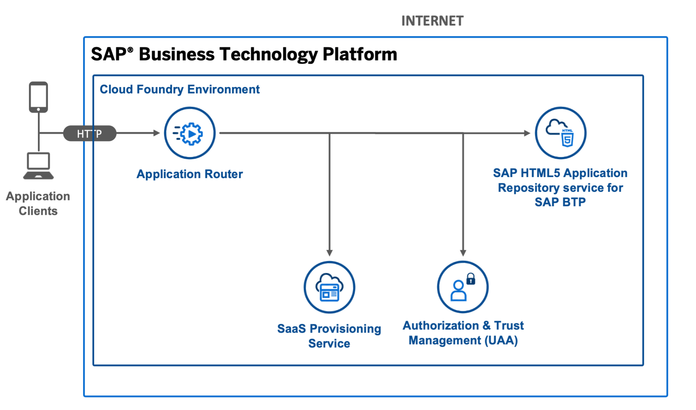
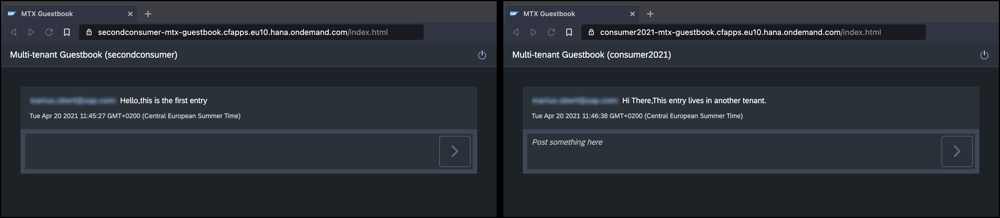

# Multi-tenant Standalone Application Router using HTML5 Application Repository

## Diagram



## Description
The image above shows the guestbook application that you will learn to build in this post. The idea of this guestbook is quite simple; each tenant will have its own guestbook that is available under a unique URL. The application comes with two role templates - reader and author. Readers can see all existing entries of that tenant, and authors can also add new entries. For more details, please refer to this [blog post](https://blogs.sap.com/2021/04/22/cloud-native-lab-4-multi-tenant-apps-in-sap-btp/).


To keep things simple, we won't add any persistence layer. We will use a standard JSON object in our extended approuter to temporarily save some data. Consequently, all data is lost once the application restarts, but this is fine for our simple demo. If you would like to persist the data, please look at the [multitenancy guide from CAP](https://cap.cloud.sap/docs/guides/multitenancy).


## Download and Installation
1. Download the source code:
    ```
    git clone https://github.com/SAP-samples/multi-cloud-html5-apps-samples
    cd multi-cloud-html5-apps-samples/standalone-mtx-approuter
    ```
2. Build the project:
    ```
    npm install
    npm run build
    ```
3. Deploy the project:
    ```
    cf deploy mta_archives/mtx-guestbook_1.0.0.mtar
    ```

If the deployment has been successful, you find the URL of the application router in the console output or you can print it on Unix-based systems with `cf app mtx-approuter | awk '/^routes/ { print "https://"$2"/" }'`. It probably has the following structure: <https://[subaccount-id]-mtx-guestbook.cfapps.eu10.hana.ondemand.com>.


## Configuration

Before deploying the project, you need to to replace the subdomain placeholders in the `mta.yaml` yaml file. If you want to subscribe multiple tenants from multiple subaccount, add new routes for them as well. For more details, please refer to this [blog post](https://blogs.sap.com/2021/04/22/cloud-native-lab-4-multi-tenant-apps-in-sap-btp/).

## Check the Result

### List the Deployed HTML5 App

```
$ cf html5-list                                     
Getting list of HTML5 applications in org 9f10ed8atrial / space dev as firstname.lastname@domain.com...
OK

name         version   app-host-id                            service instance   visibility   last changed   
mtxguestbook   1.0.0     78619acc-1181-4c75-a3d9-7ca25ed91790   mtx-guestbook-html5-host   public       Tue, 20 Apr 2021 14:09:55 GMT  
```

### List the Deployed MTA

```
$ cf mta cf mta mtx-guestbook
Showing health and status for multi-target app cf mta mtx-guestbook in org 9f10ed8atrial / space dev as firstname.lastname@domain.com...
OK
Version: 1.0.0

Apps:
name               requested state   instances   memory   disk   urls   
mtx-approuter   started           1/1         256M     256M   <provider>-mtx-guestbook.cfapps.eu10.hana.ondemand.com, <consumer>-mtx-guestbook.cfapps.eu10.hana.ondemand.com

Services:
name                          service           plan          bound apps      last operation   
mtx-guestbook-html5-host      html5-apps-repo   app-host                      create succeeded   
mtx-guestbook-html5-rt        html5-apps-repo   app-runtime   mtx-approuter   create succeeded   
mtx-guestbook-saas-registry   saas-registry     application   mtx-approuter   create succeeded   
mtx-guestbook-uaa             xsuaa             application   mtx-approuter   create succeeded   
```

### Check the Web App

Access the URL to view the web app. You are directed to a sign-on page before you can see the web app that display your name.


